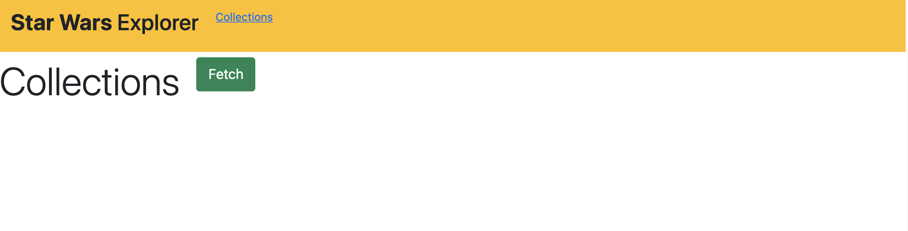
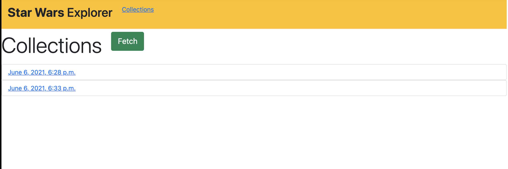
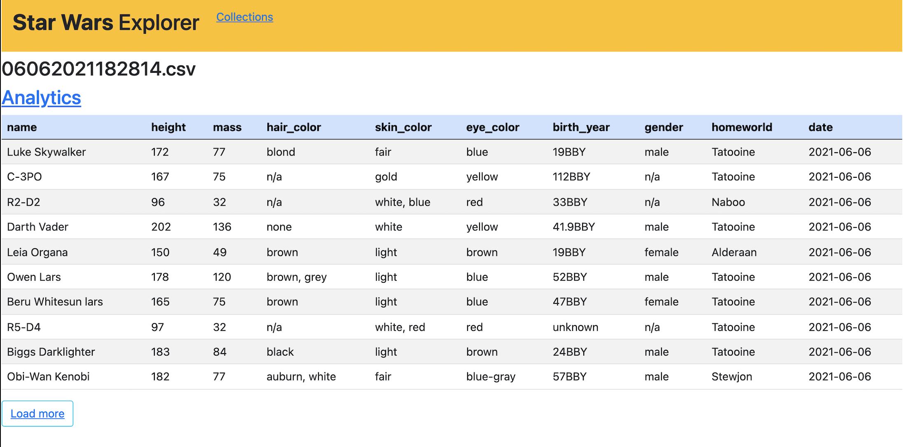
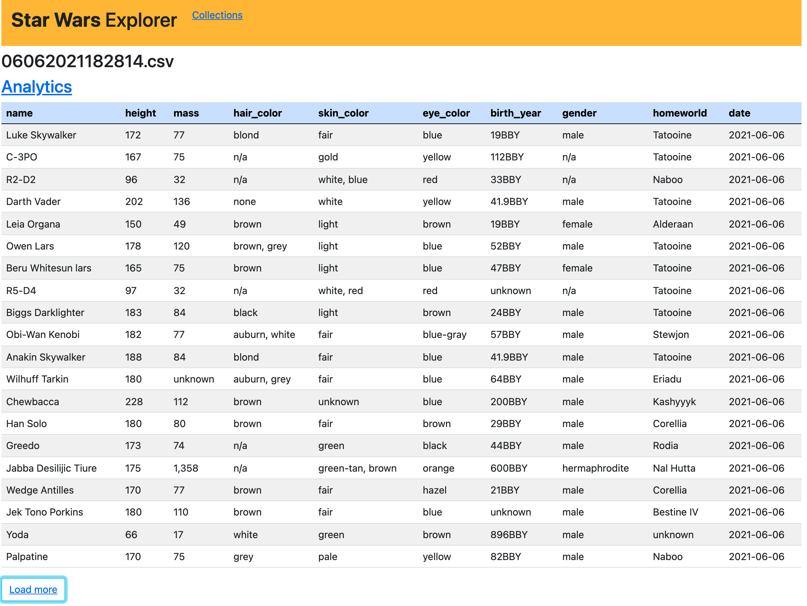
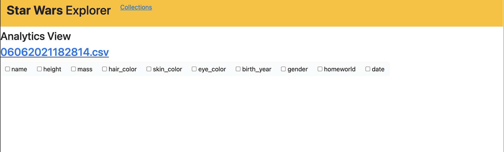
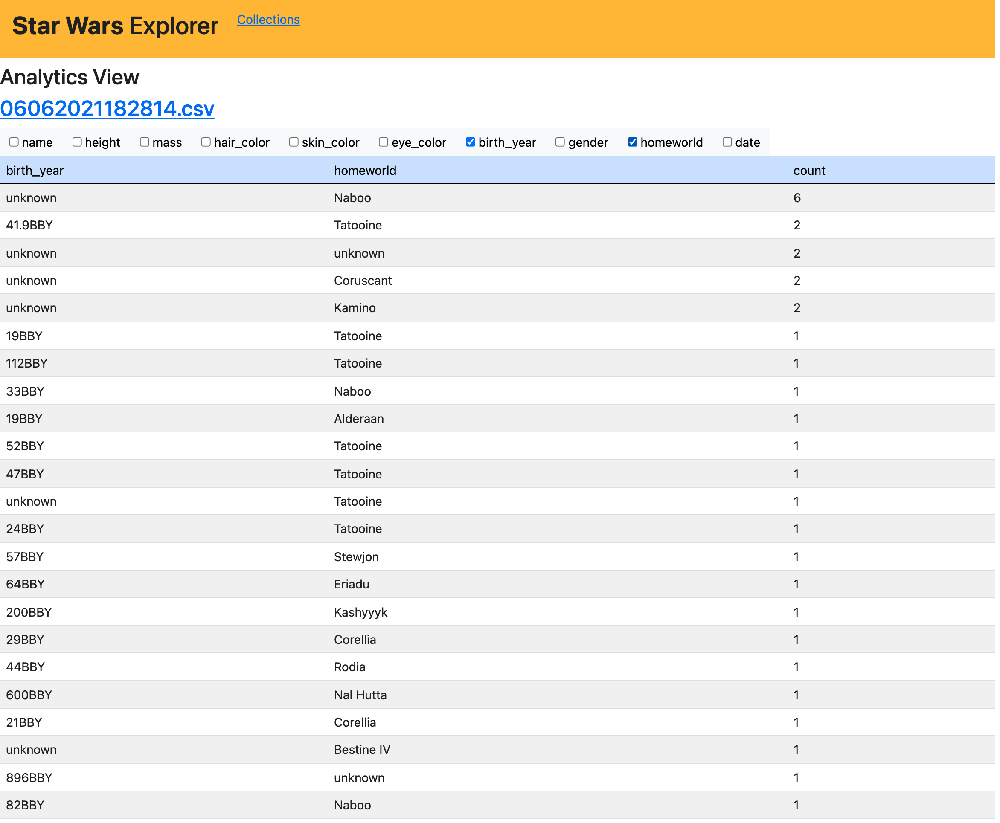

Star Wars Explorer
===============

A django rest app which allows you to collect, resolve and inspect information about characters in the Star Wars
universe from the [SWAPI](https://swapi.dev/)
---
In the Home page you can find a list of the existing collections in the Database.


You Can also click on Fetch Button to retrieve the latest information, Creates a new record in the Database, Save the
data in a new CSV file on the file system, Then redirect you to the detail view page to show the collected information



In the detail View you can click on Load More to show you more 10 records



The Load more button will be shown as long as there are more rows to be shown, then it will disappear. You can also on
the analytics link to show you a view where it counts the occurrences of values (combination of values) for columns



In the beginning now columns are selected, it only shows you a list of checkboxes where you can choose a column or a
combination of columns to get the counting data



It counts the combination in descending order from the most occurred to the least. You can get back to the detail view
by clicking the {file_name}.csv and you can always get back to the home page from any view by clicking the collections
link in the header



Setting Up Development Environment
----------------------------------
---

Running Locally
----------------------------------
---

1- create a virtualenv.

2- Activate the virtualenv you have just created.

3- Install development requirements:

    $ pip install -r requirements/local.txt

4- Apply Migrations

    $ python manage.py migrate

5- Run server

    $ python manage.py runserver

6- If you want to run tests locally

    $ python manage.py tests

Using Docker
----------------------------------
---

* Docker; if you don’t have it yet, follow
  the [installation_instructions](https://docs.docker.com/install/#supported-platforms)

* Docker Compose; refer to the official documentation for
  the [installation_guilde](https://docs.docker.com/compose/install/)

1- Configure your DB, Just go for star_wars_explorer/config/settings/base.py Line 40 Uncomment the two lines

```python
DATABASES = {"default": env.db("DATABASE_URL")}
DATABASES["default"]["ATOMIC_REQUESTS"] = True
```

then comment those lines

```python
# DATABASES = {
#      'default': {
#          'ENGINE': 'django.db.backends.sqlite3',
#          'NAME': 'mydatabase',
#      }
# }
```

2- go for star_wars_explorer/config/settings/local.py Line 55 and uncomment the following code

```python
 if env("USE_DOCKER") == "yes":
    import socket

    hostname, _, ips = socket.gethostbyname_ex(socket.gethostname())
    INTERNAL_IPS += [".".join(ip.split(".")[:-1] + ["1"]) for ip in ips]
```

Then you can build the environment, this can take a while especially the first time you run this particular command on
your development system:

    $ make build

That's it!

To run server normally at anytime, just run this command:

    $ make up

To build the app then run server:

    $ make upbuild

To open bash or excute any manage.py commands:

    $ make bash

To create superuser:

    $ make createsuperuser

To make fast migration instead of opening bash:

    $ make makemigrations

    $ make migrate

To run unittests (with running django container):

    $ make test_local

To run unittests (without running django container):

    $ make test

To allow debugging in development with ipdb, run server with this command:

    $ make debug django


